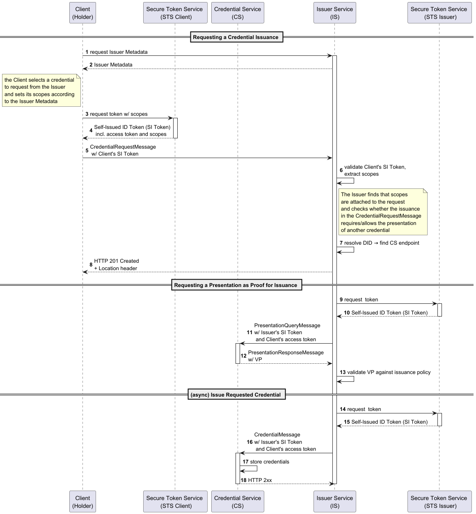
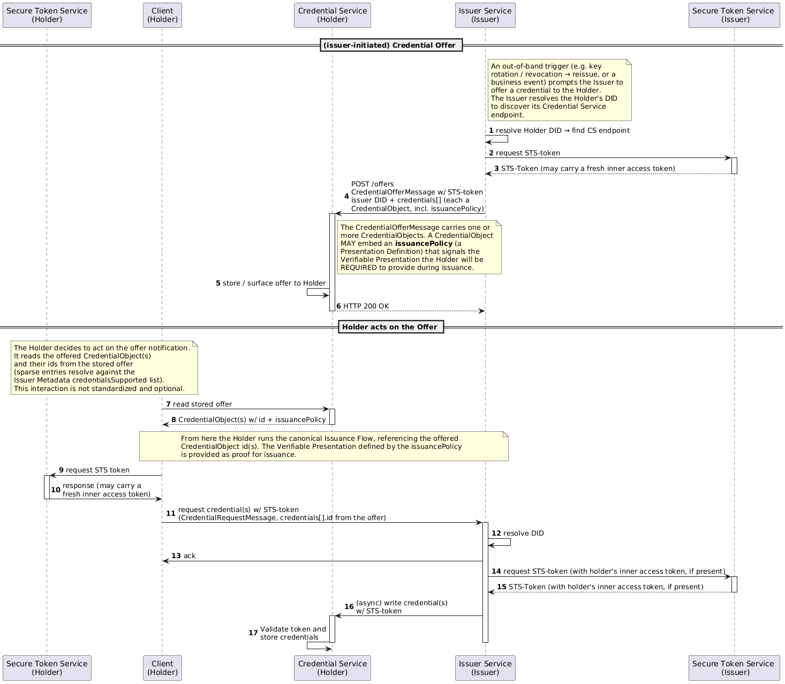

# Variations of the Issuance Flow

## Embedded Presentation

The DCP **explicitly supports** issuing credentials based on the presentation of existing credentials. This is achieved
through the embedding of the Presentation Flow into the Issuance Flow. For the complete technical flow, please consider
the following diagram.

## Credential Offers

The regular issuance flow starting with the `CredentialRequestMessage` is *holder-initiated*: they discover what's
needed from the Issuer Metadata and adds it to the `credentials` by means of the id. DCP however additionally supports an
*issuer-initiated* entry point via the **Credential Offer API**, defined in [§ 6.5 Credential Offer API](https://eclipse-dataspace-dcp.github.io/decentralized-claims-protocol/v1.0-RC2/#credential-offer-api)
of the specification. This offer runs **prior** to the `CredentialRequestMessage` and represents a notification pointing to the `IssuerMetadata`.

Entries in `credentials` MAY be *sparse* — carrying only an `id` — in which case the Credential Service resolves the
remaining `CredentialObject` properties from the `credentialsSupported` list of
the [Issuer Metadata](https://eclipse-dataspace-dcp.github.io/decentralized-claims-protocol/v1.0-RC2/#issuer-metadata-api).
Here the `issuancePolicy` requires the Holder to present a specified credential — the same
presentation the Issuer will validate against its issuance policy in the embedded-presentation flow.

The issuer has no means of deterministically correlating an incoming `CredentialRequestMessage` with a `CredentialOfferMessage`
he sent. Both messages' `id` refer to the issuer's `IssuerMetadata` entries, even if an issuer's STS-token includes a
`token` claim, the holder is not required to rewrap and replay it in their own `CredentialRequestMessage`.

The following diagram shows the issuer-initiated offer and its hand-off into the presentation-based issuance flow:

